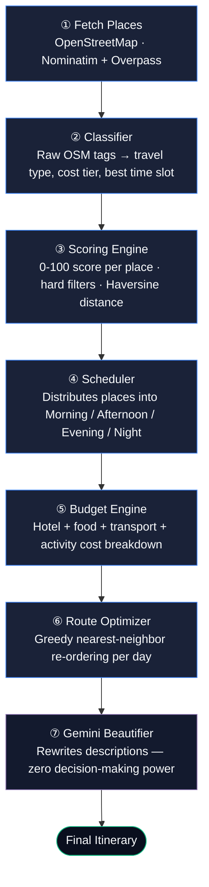

# PLANORA

### The travel planner that computes your trip instead of guessing it.

<em>A full-stack itinerary engine that scores, schedules, and routes real-world places —
Gemini only touches the words, never the decisions.</em>

<br/>


<br/>

[Overview](#overview) • [The Engine Pipeline](#the-recommendation-pipeline) • [Tech Stack](#tech-stack) • [Features](#features) • [API](#api-reference) • [Setup](#getting-started)

</div>

---

## Overview

Most "AI travel planner" projects are a single prompt wearing a UI. Planora isn't.

Ask any AI-wrapper app *why* it put the museum before the beach, or *how* it split your budget, and it can't tell you — because there's no logic underneath, just a language model improvising. Planora is built the other way around: **every decision is deterministic, inspectable, custom-written JavaScript.** Gemini is called exactly once per trip, at the very end, and its only job is to rewrite descriptions so they read well. It never chooses a place, never sets a price, never builds a schedule.

The result is a system where you can point at any line in the itinerary and trace it back to the code that produced it.

```
User Input  →  7 deterministic engines  →  Structured itinerary  →  Gemini rewrites the prose
                     (the actual product)                          (the only AI call)
```

---

## The Recommendation Pipeline

Seven engines run in sequence, each one a plain function you can read top to bottom — no black box, no hidden prompt chain.



| # | Engine | File | What it actually does |
|---|--------|------|------------------------|
| 1 | **Fetch Places** | `openTripMapService.js` | Geocodes the destination via Nominatim, then pulls real POIs from the Overpass API — no static/mock data |
| 2 | **Classifier** | `classifierService.js` | Maps raw OSM categories (beaches, museums, fortifications, etc.) to structured metadata: travel type fit, cost level, time required, best time of day |
| 3 | **Scoring Engine** | `scoringEngine.js` | Scores every place 0–100 against user preferences, applies hard filters, and computes real distances with the Haversine formula |
| 4 | **Scheduler** | `schedulerService.js` | Fills Morning/Afternoon/Evening/Night slots per day based on score ranking and the user's chosen pace (relaxed / balanced / packed) |
| 5 | **Budget Engine** | `budgetEngine.js` | Builds a full cost breakdown — hotel tier, food per traveler per day, transport estimate, and summed activity cost |
| 6 | **Route Optimizer** | `routeOptimizer.js` | Re-orders each day's stops with a greedy nearest-neighbor walk so you're not zig-zagging across the city |
| 7 | **Gemini Beautifier** | `geminiService.js` | Takes the finished itinerary and rewrites place descriptions in more engaging language — text only, no logic |

---

## Features

**Core planning**
- Custom 7-engine itinerary pipeline (above) — not a prompt in a trench coat
- Day-by-day schedule broken into time slots
- Budget breakdown with an interactive pie chart
- Interactive map with live place markers (Leaflet + OpenStreetMap)

**Editing & control**
- Swap, remove, or add custom places to any slot
- Drag-and-reorder stops within a day
- Per-slot notes
- One-click reset back to the original generated plan

**Account & sharing**
- JWT auth with bcrypt-hashed passwords, plus forgot-password flow
- Save trips, mark favorites, and browse them from a dashboard with trip stats
- Export any itinerary to PDF
- Public shareable trip links — no login required to view

---

## Tech Stack

| Layer | Technology |
|---|---|
| **Frontend** | React 19, React Router, custom CSS design system (dark theme, CSS custom properties), Recharts, Leaflet / React-Leaflet, Anime.js, Axios |
| **Backend** | Node.js, Express 5 |
| **Database** | MongoDB Atlas + Mongoose |
| **Auth** | JWT + bcrypt |
| **Places data** | OpenStreetMap — Nominatim (geocoding) + Overpass API (POIs) |
| **AI** | Gemini API — text beautification only, no decision-making |
| **PDF export** | PDFKit |
| **Build tooling** | Vite, oxlint |

> Note: the frontend uses a hand-rolled CSS design system with theme tokens (`--bg-primary`, `--accent`, etc.) rather than a utility framework — full control over the dark UI, no class soup.

---

## Project Structure

```
PLANORA/
├── planora-backend/
│   ├── server.js
│   ├── routes/            # authRoutes.js · tripRoutes.js
│   ├── controllers/       # authController.js · tripController.js
│   ├── models/            # User.js · Trip.js
│   ├── middleware/        # authMiddleware.js
│   └── services/          # the 7 engines live here
│       ├── openTripMapService.js
│       ├── classifierService.js
│       ├── scoringEngine.js
│       ├── schedulerService.js
│       ├── budgetEngine.js
│       ├── routeOptimizer.js
│       └── geminiService.js
│
└── planora-frontend/
    └── src/
        ├── pages/          # Landing, Login, Signup, Dashboard, TripGenerator, TripResult, TripEditor, SharePage
        ├── components/     # Navbar, TripCard, ItineraryView, EditableDayCard, MapView, BudgetPieChart, PlaceSuggestions
        ├── context/        # AuthContext.jsx
        └── api/            # axios.js
```

---

## API Reference

**Auth** — `/api/auth`

| Method | Endpoint | Description |
|---|---|---|
| `POST` | `/signup` | Create an account |
| `POST` | `/login` | Authenticate and receive a JWT |
| `POST` | `/forgot-password` | Trigger password reset flow |

**Trips** — `/api/trips` (JWT-protected unless noted)

| Method | Endpoint | Description |
|---|---|---|
| `GET` | `/:id/share` | 🔓 Public — view a shared trip, no auth |
| `POST` | `/generate` | Run the full 7-engine pipeline for a new trip |
| `GET` | `/all` | List the current user's trips |
| `GET` | `/:id` | Fetch a single trip |
| `DELETE` | `/:id` | Delete a trip |
| `PATCH` | `/:id/favourite` | Toggle favorite status |
| `PATCH` | `/:id/edit/swap` | Swap a place in a slot |
| `PATCH` | `/:id/edit/remove` | Remove a place from a slot |
| `PATCH` | `/:id/edit/custom` | Add a custom, user-defined place |
| `PATCH` | `/:id/edit/reorder` | Reorder slots within a day |
| `PATCH` | `/:id/edit/note` | Attach a note to a slot |
| `PATCH` | `/:id/edit/reset` | Reset itinerary back to the original |
| `GET` | `/:id/suggestions` | Get alternative place suggestions |
| `GET` | `/:id/export` | Export itinerary as PDF |

---

## Getting Started

### Prerequisites
- Node.js v18+
- A MongoDB Atlas connection string
- A free Gemini API key from [aistudio.google.com](https://aistudio.google.com)

### Backend

```bash
cd planora-backend
npm install
```

Create a `.env` file:

```env
PORT=5000
MONGO_URI=your_mongodb_connection_string
JWT_SECRET=your_jwt_secret
GEMINI_API_KEY=your_gemini_api_key
```

```bash
node server.js
```

### Frontend

```bash
cd planora-frontend
npm install
npm run dev
```

App runs at `http://localhost:5173`.

---

<div align="center">

Built to prove that a good recommendation engine doesn't need an LLM to make decisions — just to describe them well.

</div>
